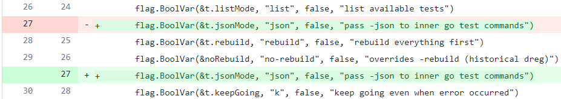

# Patch files vs. in-place modifications

The Microsoft Go project needs to be able to maintain modifications to the Go source code but also keep up with the latest versions of Go. There are two main approaches to maintain this kind of modification over time:

1. Make changes directly to the files, "in place". Periodically merge from the official Go repository and resolve conflicts as merge commits.
2. Put the changes into patch files. Periodically move to a newer version of the official Go source code and attempt to apply the same patch files. If they don't apply cleanly, resolve conflicts by fixing up the patch files.

> A *patch file* is a text file that contains all the data necessary to create a commit that performs some changes. It's typically created using [`git format-patch`](https://git-scm.com/docs/git-format-patch). It contains commit title, author, commit message, and the source code diff. [`git apply`](https://git-scm.com/docs/git-apply) applies the diff, and [`git am`](https://git-scm.com/docs/git-am) applies the diff *and* creates a commit containing the changes.

The Microsoft Go project uses patch files for modifications to the Go source code. This trades off some ease of development for maintainability benefits.

# Background

Patch files and in-place modifications are both used by Linux distributions that include the Go repository.

1. [Fedora has a Go fork](https://pagure.io/go/tree/go1.17-openssl-fips) that includes changes made directly to the source files.

1. [Fedora builds the Go package](https://src.fedoraproject.org/rpms/golang/tree/rawhide) by downloading an official source `tar.gz` file, applying patches, then building.

1. [CentOS AppStream builds the golang package](https://rpmfind.net/linux/RPM/centos/8-stream/appstream/x86_64/Packages/golang-bin-1.17.5-1.module_el8.6.0+1052+72a6db00.x86_64.html) starting with the Fedora fork of Go, applying a patch on top, then building.

1. [Debian builds the Go package using a Go fork](https://salsa.debian.org/go-team/compiler/golang/-/tree/golang-1.17), and it [uses patch files stored in the `debian/patches` directory](https://salsa.debian.org/go-team/compiler/golang/-/tree/golang-1.17/debian/patches).

All these distros use patch files. The Fedora Go fork does include in-place modifications, but it is wrapped by a repository that also uses a patch file on top: both methods end up being used.

# Core dev workflow

## Patch files are inconvenient to create
Creating a patch file is more work than committing a change. The basic workflow is to create a commit, then format it as a patch file. Tooling can mitigate the impact by providing tools rather than having to type up Git commands, but it is unavoidable that we have some extra step.

## Reviewers see diffs of diffs (bad)
Changing a patch file in a PR means the PR will display a diff of the patch file: a diff diff. These can be difficult to interpret. This diff means that a flag statement is being moved to a later line:

A tool could be created that applies the patch before and after the change, and shows a diff of those two states. The tool could be added to CI so this view is generated automatically. However, this creates an obstacle for reviewers and wouldn't be compatible with existing review tools.

## Reviewers see diffs of diffs (good)
A diff diff is sometimes easier to review:

* A PR that reverts parts of a patch file is easy to review: lines are deleted from the patch file, which means those parts of the source code now match what exists in the upstream repository.
* The same change without patch files will appear to be a bunch of random changes throughout the source code. A reviewer would need to run their own diffs comparing against the upstream repo to figure out if the diffs are actually reverting the code, or if there's some mistake.

## Taking a new version of upstream is less risky
Sometimes when updating to a new version of Go, the patch files will no longer apply cleanly. This means a developer (or automation) must resolve the conflict and create a fixed patch file. If multiple patch files have conflicts, each file is fixed separately. This work can be shared, so the person with the best knowledge of each patch can resolve that patch's conflict.

Without patch files, the way to update to a new version of Go is to use `git merge`. This merges the file state of the branch, so all conflicts show up at the same time and the reason behind each difference may not be trivial to figure out. *If* a single developer has the knowledge to fix all conflicts, or if the conflicts are all trivial, this *may* take less time than fixing patch file conflicts. However, this is unlikely to always be the case. If the developer makes a mistake, it is harder to discover in a merge commit than it is in a patch file change.

Patch files are analogous to using `git rebase` to bring a feature branch up to date rather than using `git merge` to bring it up to date.

# Git archaeology

## `git blame` history is not as straightforward
When you run `git blame` on a repository with a patch file applied to it, you see *which patch file* added each line. You don't have direct access to *which change to the patch file* last affected that line. There are effectively two tiers of Git history.

## Patch history preserves more detail
When a patch file is changed to resolve a conflict with a new version of upstream, or changed to fix a bug, Git history of that specific patch file will list these changes along with their motivations. This makes it easy to single out a patch file (including any fixes) and submit it to upstream.

A merge commit or followup bugfix, on the other hand, is not as tightly linked to the original change. It may be a significant undertaking to single out a specific feature for submission to upstream.

## Building partially patched is possible
With patch files, it's possible to run a build that applies no, some, or all patches. This could be useful to determine if a certain patch is suspected to be the cause of a bug. Running a `git bisect` would mix in upstream changes with patch changes, because the Git history is not distinct.

The internal rolling builds could also build multiple configurations: always provide an "unpatched" and "patched" Go toolset. This could be used to compare behavior and help narrow down issues without building a new copy of Go.

# Collaboration

## Patch files can be shared
With Microsoft maintaining a set of patch files, other teams may want to use them too. Patch files are a normal part of Linux distribution build systems, and because they apply to the official Go source code, this is an easy way to collaborate.

If the changes were committed directly to the source code, the most feasible way to share them would be to share the entire Git fork, which may contain features that not everyone wants to include. It's difficult to extract specific features this way, so this could make it hard to work with the same code.

## Changes are easily accounted for
With patch files that apply onto the upstream commits, it is easy for anyone to look through every change that has been made on top of upstream, with context for the change right there in the patch file.

With changes made by committing on top of upstream, it's possible to use Git commands to look at a diff, or look through each non-upstream commit. However, this is not trivial, it will likely show many irrelevant commits along with the important ones, and it's not possible through the GitHub web UI.
