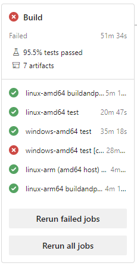
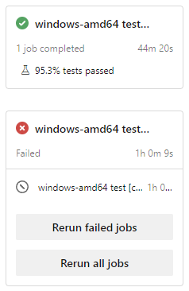

# Azure pipeline YAML style

Our pipeline implementation is shaped by a few AzDO pipeline and YAML quirks. This doc contains notes on these quirks and how they influence how we've written the pipeline YAML.

These notes also apply to the [microsoft/go](https://github.com/microsoft/go) pipelines.

Useful AzDO Pipeline YAML docs:
* [YAML schema reference for Azure Pipelines](https://docs.microsoft.com/en-us/azure/devops/pipelines/yaml-schema)
  * [Shortcut steps: `pwsh`, `script`, `publish`, etc.](https://docs.microsoft.com/en-us/azure/devops/pipelines/yaml-schema/steps?view=azure-pipelines)
* [Template types & usage](https://docs.microsoft.com/en-us/azure/devops/pipelines/process/templates?view=azure-devops)
* [Build and release tasks](https://docs.microsoft.com/en-us/azure/devops/pipelines/tasks/?view=azure-devops)

General YAML resources:
* [Advanced multi-line value handling (`>`, `|`, ...)](https://yaml-multiline.info/)

## Faster retry: one stage per job

A typical way to arrange an AzDO pipeline is to add a job for each platform into a single stage:

> 

The "Rerun failed jobs" button is useful to rerun flaky jobs while leaving the successful status intact on the other jobs.

However, this button only works when all jobs in the stage have completed (succeeded or failed). This is a problem: if a job fails quickly and other jobs are still running, you have to wait for all jobs to finish before you can retry the failed job. This wastes time in a few ways:

* You need to keep an eye on the pipeline to trigger the retry as soon as the other jobs are complete.
* Assuming the jobs take roughly the same time to complete, the total time to finish CI is now at least double the usual time because the retry doesn't run in parallel with the other jobs.

Instead of waiting, you could cancel the whole build to make all the jobs fail quickly and then retry all jobs. This wastes the time already spent making progress on the in-progress jobs, which is particularly bad if the canceled jobs are even longer than the one that failed.

The workaround we use in microsoft/go CI to avoid wasting time is to use one stage per job, so any stage/job can be retried as soon as it fails:

> 

> Related feedback item: [Allow failed Jobs to be retried as soon as they have finished running - Visual Studio Feedback](https://developercommunity.visualstudio.com/t/Allow-failed-Jobs-to-be-retried-as-soon/10130213)

> Also requested internally (2018): https://dev.azure.com/dnceng/internal/_queries/edit/110

## Dynamic vs. typed template parameter declarations

Most of our templates use dynamic template parameters. These look like:

```yml
parameters:
  apple: 2
  lemon: "acidic"
  orange: true
```

In this mode, additional parameters can be passed when using a `- template: ...` statement. All parameters other than objects and lists seem to be typecast to `string` when passed in. This means `${{ if parameters.orange }}` will pass if `orange` is passed in as `false`, because the implicitly converted `"False"` is truthy.

A workaround is to instead use `${{ if eq(parameters.orange, true) }}` to (it seems) perform the implicit cast on both sides.

Some templates instead use typed parameters:

```yml
parameters:
  - name: orange
    type: boolean
    default: true
```

In this mode, any additional parameters passed by a `- template: ...` statement are rejected as a template evaluation error. If we need some arbitrary parameters, we use an extra `object` param.

Because `orange` is passed as a `boolean`, `${{ if parameters.orange }}` evaluates as expected.

## Runtime parameters

[Runtime parameters](https://docs.microsoft.com/en-us/azure/devops/pipelines/process/runtime-parameters) are a way to specify parameters for a pipeline run that show up at the top level of the "Run" dialogue. These are nicer to use for commonly adjusted user inputs than variables: you don't need to dig deep in the UI to change them, and they have friendly labels defined in the pipeline YML file. The parameters are also usable in AzDO templates without the limitations of variables.

We also use runtime parameters to transfer release data between pipelines in the automated release process.

In AzDO YML, a runtime parameter either has a default value, or a value must be assigned by the user before the "Run" button is enabled.

### 'nil' string default

A problem is that AzDO doesn't treat the empty string `''` as a valid default value: AzDO requires the user to specify some non-empty string before hitting "Run". We sometimes need to define an optional string parameter without any meaningful default value. If `''` worked, it would be the easy choice for this scenario, but it doesn't work.

As a workaround, when we need an optional string parameter, we use the string `nil` as the default value and `ne(parameter.example, 'nil')` to check if the parameter was set. For example:

```yml
parameters:
  - name: example
    displayName: 'Description of an example pseudo-optional string parameter'
    type: string
    default: nil
```

## Templates for data reuse

AzDO supports [variable templates](https://docs.microsoft.com/en-us/azure/devops/pipelines/process/templates?view=azure-devops#variable-templates-with-parameter), but it's hard to determine where variables defined this way are usable. For example, a macro expansion `$(example)` will evaluate to define a job's pool name, but not the demands on that pool. A runtime expression `$[example]` will not evaluate in either case. A template expression `${{ example }}` will always work.

For universal applicability, we use templates to share logic and values between stages. Another benefit is early evaluation: we can sometimes catch errors in the queue dialog (rather than at build-time), saving dev time.

## Editing tools

The [Azure Pipelines extension for VS Code](https://marketplace.visualstudio.com/items?itemName=ms-azure-devops.azure-pipelines) fails to parse our templates properly. It doesn't generally understand template expressions, doesn't understand dynamic template parameters, and the language server crashes when it sees `insert` as the first element in a list, like this:

```yml
- ${{ each value in parameters.thing }}:
  - ${{ insert }}: ${{ value }}
    answer: 42
```

We edit the YAML files with generic YAML tools.

## Indentation style

We indent when starting a new list in the YAML files in this repository. This isn't typical for pipeline YAML: in AzDO docs, a list's `-` is on the same column as the element containing the list. Both styles are commonly found in general YAML files. For example, we use:

```yml
stages:
  - template: shorthand-builders-to-builders.yml
    ...
    shorthandBuilders:
      - ${{ if eq(parameters.innerloop, true) }}:
        - { os: linux, arch: amd64, config: buildandpack }
        - { os: linux, arch: amd64, config: devscript }
      - ${{ if eq(parameters.outerloop, true) }}:
        - { os: linux, arch: amd64, config: longtest }
```

vs.

```yml
stages:
- template: shorthand-builders-to-builders.yml
  ...
  shorthandBuilders:
  - ${{ if eq(parameters.innerloop, true) }}:
    - { os: linux, arch: amd64, config: buildandpack }
    - { os: linux, arch: amd64, config: devscript }
  - ${{ if eq(parameters.outerloop, true) }}:
    - { os: linux, arch: amd64, config: longtest }
```

This style makes indent guides work in tools like VS Code. The line below `stages` runs to the left of each stage element. The line below `shorthandBuilders` shows a line to the left of every condition used to include builders. Without the indent before `-`, there is no indent guide for these lists.
