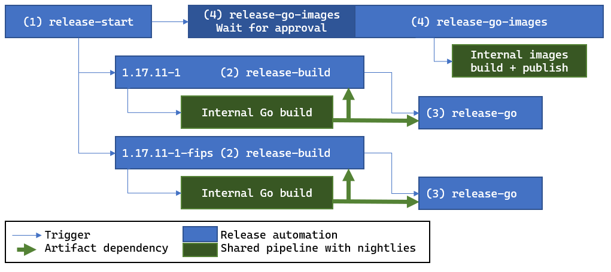

# Release process

We have a handful of pipelines to manage the steps creating a release.

The goal is to have this system handle the easy stuff that's easy to mistype or forget, and that's annoying to copy-paste.

All steps written below are performed by the release pipeline (not by the dev) unless stated otherwise.

See [instructions.md](instructions.md) for more info about how to use this infrastructure.

# Pipelines

The pipeline flow is arranged like this, with an example 1.17 patch release shown:

> 

The next sections of the doc describe each of the numbered release automation pipelines.

## (1) release-start

Inputs:
* A list of `major.minor.patch-release[-note]` release numbers.
    * Example:
        ```
        - 1.17.11-1
        - 1.17.11-1-fips
        - 1.18.3-1
        - 1.18.3-1-fips
        ```

Steps:
1. Create a tracking issue for the release event, and one for each release number.
1. Launch a "(2) release-build" for each release/issue.
1. Launch one "(4) release-go-images" that includes all release version numbers.
    * This pipeline has to wait for (2) to finish. We just launch it now while we have all the info necessary to kick it off.

## (2) release-build

Inputs:
* A single `major.minor.patch-revision[-note]` release number.
    * The note determines whether this is a boring/FIPS release.
* microsoft/go release issue number.
* (Optional) One or more IDs to start polling.
    1. microsoft/go PR number.
    1. microsoft/go commit hash created by PR merge.
    1. AzDO Go pipeline build id.
    1. microsoft/go-images PR number.
    * The last one defined "wins", and the job starts by polling that. This means if the dev needs to re-trigger this job after a failure, they can simply fill in the last parameter the build was stuck on.

Steps:
1. Poll the upstream Go repository for the release availability.
    * If a normal release branch, fail immediately if the tag isn't available.
    * If boring/FIPS, poll the RELEASES file.
1. Create an auto-update PR updating to the specific commit released by upstream.
1. Poll CI and merge status for a green merge.
1. Poll the internal repository until the merged commit is mirrored.
1. Launch an internal build on the merged commit.
1. Poll the build for successful completion.
1. Download the build results onto the agent.
1. Check the build results match the expected Go version.
1. Tag the commit on GitHub.
1. Add a GitHub release on the tag. Attach the source archive files and assets json.
1. Update aka.ms links.
1. Create an auto-update PR for go-images that updates it to the internal build.
1. Poll auto-update PR CI and merge status for a green merge.

If any polling steps fail (or time out), the pipeline notifies the dev handling the release by commenting on the release issue on GitHub.

## (3) release-go-images

Inputs:
* A list of major.minor.patch release numbers.
* microsoft/go release issue number.
* A checkbox to skip the approval stage. (Default: off.)
* (Optional) One or more IDs to start polling.
    1. microsoft/go-images commit hash that has been updated to contain all the release numbers.
    1. AzDO go-images pipeline build id.

Steps:
1. Manual approval step (if enabled): only start polling once a dev thinks it's reasonable and presses the approve button.
    * Pipelines 2 and 3 can take a while. It's better to wait in a server job than reserve a build agent to do useless polling.
1. Poll the latest `microsoft/main` go-images commit in AzDO to find the final commit hash that contains the set of versions matching all target versions.
1. Poll the internal repository until the merged commit is mirrored.
1. Run the go-images internal build pipeline in "build;publish" mode.
    * Unusual servicing events (e.g. a Microsoft-only revision) may only require a subset of platforms to be built, rather than the full set. In these cases, this pipeline shouldn't be used. The dev should reject the approval step and handle the steps themselves.
1. Poll the build for successful completion.

# Why not use AzDO's stage/job retries and Release Pipelines?

The release pipelines don't take advantage of the "retry failed jobs" or stage retry features of AzDO. Instead, we queue a new build with configuration to make it avoid re-running any steps that were already completed. There are a few reasons we don't think the AzDO retry logic is currently suitable for these pipelines:

* AzDO retry granularity is at the job or stage level, not step level. Our steps are not idempotent: running them a second time would fail.
    * We could reimplement each step to be idempotent, but it would be considerably more complex and we amy need to externalize state in places that previously didn't need to.
    * We could split up steps into multiple jobs or stages, but acquiring an agent can take a while, and we would be multiplying that time.
        * Running parallel jobs/stages could mitigate this, but a significant amount of the release pipeline must be sequential. (In particular **(2) release-build**.)
* There is no way to change variables/parameters for an AzDO retry.
    * The microsoft/go-infra commit the pipeline uses for the YAML pipeline cannot be changed. There is also no opportunity to change the input parameters and variables.
    * Example modifications that will sometimes be necessary:
        * A pipeline YAML fix.
        * go-infra tooling fix.
        * Polling a fixed PR number submitted by a dev rather than a broken PR that will never merge.

Instead, the pipelines are written to be as easy to re-run with modified parameters as possible. Usually a retry involves copy-pasting a single number into the "run new build" dialog. See [instructions.md#retrying](instructions.md#retrying)

Another AzDO feature we aren't using is [Release Pipelines](https://docs.microsoft.com/en-us/azure/devops/pipelines/release/?view=azure-devops). These seem to have more flexiblity than pipelines to modify and retry in the middle of a release that's running. However, there is no YAML (source-controlled) workflow, and they are called "classic" now, so we don't think we should add new dependencies on them.

If more AzDO features are added in the future that overcome these limitations, we should use them.
