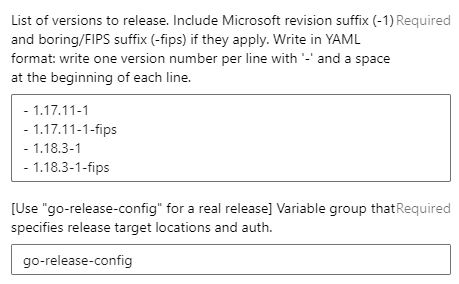
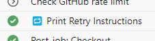
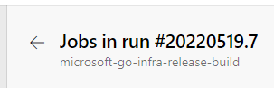

# How to use the release tooling

Open the [microsoft-go-infra-release-start](https://dev.azure.com/dnceng/internal/_build?definitionId=1153) pipeline definition. It will kick off the release day.

Click "Run pipeline" and fill the fields. For example, a security patch release for 1.17 and 1.18 may look like this:

> 

* **List of versions to release** is a YAML list. If there's a `dev.boringcrypto.go*` branch associated with the version being released, both the non-FIPS and FIPS versions must be filled in.
    * Versions <= 1.18 have boring branches and need both `-FIPS` and non-FIPS versions listed.
    * Versions >= 1.19 do not need `-FIPS` versions listed.
    * Sometimes, we have to release when upstream hasn't made any changes. For example, to fix an issue with the FIPS implementation, or Go being built incorrectly by our infrastructure. In this case, increment the revision number from what it was for the latest release. If 1.18.3-1 was the latest, use 1.18.3-2 as the version.
* The variable group should be filled in with `go-release-config`.

> Even though AzDO doesn't show the text selection cursor, you can actually click and drag to select `go-release-config` and copy-paste it into the text box.
>
> It may seem strange that `go-release-config` isn't the default. But:
>
> * For testing, you can pass in a different variable group. Requiring this field to be filled in each time makes sure you intend to run a real release.
> * This makes infrastructure safer: if the build gets triggered and the set of parameters isn't passed correctly by tooling, the build fails safe by refusing to start.

1. Once the values are set, run the build.
    * It will take some time to reserve a build agent. Then, it creates one issue to track the release day progress and one issue per version in the list.
    * You should make sure you're subscribed to each issue. The builds will post comments on these issues to alert you to successful jobs and failures. If you don't see the issues in the microsoft/go repository, look in the job logs. The "Create tracking issue" steps contain links.

1. Open the job logs, click on the "🚀 Start microsoft/go-images build" step, and click on the `Web build URL:` link.

1. Wait for notification about the "microsoft/go build prep steps" completing for each version.
    * If an error occurs, refer to the rest of this doc for diagnosis and retry guidance.

1. In the microsoft/go-images build, approve the build to let it continue.
    * It is ok to do this early. The approval gate only exists to prevent excessive polling.

1. Send a message to the internal announcement distribution group about the new version!
    * Check this internal page for more details: [Internal announcement email and DG](https://microsoft.sharepoint.com/teams/managedlanguages/_layouts/OneNote.aspx?id=%2Fteams%2Fmanagedlanguages%2Ffiles%2FTeam%20Notebook%2FGoLang%20Team&wd=target%28Main.one%7C62B655D4-14E7-41D6-A063-0869C28D63FC%2FInternal%20announcement%20email%20and%20DG%7C23BE5288-5430-4B45-A81B-9AE79776743C%2F%29)

## Error in microsoft-go-infra-release-build

If an error occurs in the release-build pipeline, first read the logs. In some cases all you need to do is retry:

* The sync PR validation jobs are taking longer than expected and the polling failed due to a timeout.
* The GitHub rate limit expired and the pipeline wasn't able to wait for a refresh.
* The internal build failed due to flakiness or an infrastructural reason.
* The GitHub -> AzDO mirror is not working.
    * Look for an outage already reported in the [First Responder Teams channel](https://teams.microsoft.com/l/channel/19%3aafba3d1545dd45d7b79f34c1821f6055%40thread.skype/First%2520Responders?groupId=4d73664c-9f2f-450d-82a5-c2f02756606d&tenantId=72f988bf-86f1-41af-91ab-2d7cd011db47), or post about the issue there. Once the issue is resolved, retry the build.

**Don't use the "Rerun failed jobs" button. See [Retrying](#retrying).**

There are other kinds of issues that need thoughtful fixes. For example:

* The sync to upstream PR conflicted with a patch file and sync PR CI is failing.
* The go-images update PR couldn't be generated properly.

In those cases, you may need to retry from an earlier step. Or, you may need to make a fixup PR in the microsoft/go repo and then retry the build using a different value (e.g. your own PR's merged hash) rather than the original value.

# Retrying

1. To retry a release job, continuing from the last-running polling step, find the **🔁 Print Retry Instructions** step:

    > 

1. Click it, and scroll to the end of the log to find the retry parameters:

    > ```
    > To retry, press "Run new" from the build main page and copy the last defined value below into the matching parameter input:
    >
    > 1: nil
    > 2: b2815b0d4b694ab2ed293a8f8a42ee84cab662d4
    > 3: nil
    > 4: nil
    > ```

1. Copy the last value in the list (`b2815b0d4b694ab2ed293a8f8a42ee84cab662d4`) and click the back arrow at the top of the build page to go back to the build's main page:

    > 

1. Then, press **Run new** in the top right.
1. Paste the string into the box with the matching number.
1. Did a failure occur with Git tag publishing, GitHub Release publishing, or aka.ms URL updating?
    * If any of these steps succeeded, uncheck the checkbox in the retry dialogue.
1. Finally, press **Run**.

> When you press "Run new" from a failed build, parameters are filled in with the current build's values. For example, you don't need to fill in the `go-release-config` variable group name again when you run a retry.

> The "Rerun failed jobs" button at the top right *does not work* for release-build. This AzDO feature is not flexible enough to handle fixups. Don't worry: if you press it, the build will detect it and fail itself early.
