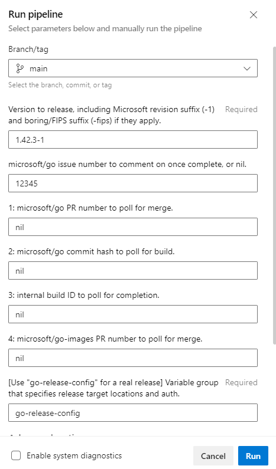

# How to use the release tooling

## Creating the tracking issue

First, create an issue on the microsoft/go repository for release progress updates. When you pass the issue number to the release automation pipeline, that makes the pipeline post a comment on that issue to notify you when a step completes or fails.

If dealing with multiple releases at the same time (for example, 1.17 and 1.18 security patches released on the same day), create one issue per version number. This makes it easier to keep track of each release's progress as an outside observer.

> The "release-start" pipeline is planned to create these issues automatically for common servicing events. (See [README.md](README.md).)

## Upstream release

After an upstream release, or in anticipation of an upstream release, go to the [`microsoft-go-infra-release-build`](https://dev.azure.com/dnceng/internal/_build/results?buildId=1780270&view=results) pipeline. Press "Run new" and fill in the blanks. For example, a 1.42.3-1 patch release would look like this:

> 

> Even though AzDO doesn't show the text selection cursor, you can actually click and drag to select `go-release-config` and copy-paste it into the text box.
>
> It may seem strange that `go-release-config` isn't the default. But:
>
> * For testing, you can pass in a different variable group. Requiring this field to be filled in each time makes sure you intend to run a real release.
> * This makes infrastructure safer: if the build gets triggered and the set of parameters isn't passed correctly by tooling, the build fails safe by refusing to start.

Once the values are filled in, press Run.

You can close the tab as soon as the build starts looking for an agent. If nothing goes *terribly* wrong, the build will notify you if it needs intervention by commenting on the release issue.

## microsoft/go revision

Sometimes, we have to release when upstream hasn't made any changes. For example, to fix an issue with the FIPS implementation, or Go being built incorrectly by our infrastructure.

In this case, run release-build, and increment the revision number from what it was for the latest release. If 1.18.3-1 was the latest, use 1.18.3-2 as the version.

The infrastructure will make sure the submodule still points at `go1.18.3`, then run the remaining release steps.

# Retrying

If a step fails or a timeout is exceeded, the build needs to be retried. To do this, look in the job logs for the retry instructions step:

> 

Click it, and scroll to the end of the log to find the retry parameters:

> ```
> To retry, press "Run new" from the build main page and copy the last defined value below into the matching parameter input:
>
> 1: nil
> 2: b2815b0d4b694ab2ed293a8f8a42ee84cab662d4
> 3: nil
> 4: nil
> ```

Copy the last value in the list (`b2815b0d4b694ab2ed293a8f8a42ee84cab662d4`) and click the back arrow at the top of the build page to go back to the build's main page:

> 

Then, press "Run new" in the top right. Paste the string into the box with the matching number, then press Run.

> When you press "Run new" from a failed build, parameters are filled in with the current build's values. For example, you don't need to fill in the `go-release-config` variable group name again when you run a retry.

> The "Rerun failed jobs" button at the top right *does not work* for release-build. This AzDO feature is not flexible enough to handle fixups. Don't worry: if you press it, the build will detect it and fail itself early.

## Fixup

Sometimes a step fails and a simple retry won't help. In this case, fix up what needs to be fixed, then use "Run new" to let the infrastructure monitor the situation and keep moving.

For example, if the sync PR fails because of a patch conflict, go to the sync PR, push the resolution, and start the release job back up with field (1) filled in with the PR number.

If the fix is complex, you can skip (1). You can merge your PR(s), find the final merge commit hash, and pass that in field (2). Use your best judgment.

This approach works for other steps, too. If the internal build failed, but another internal build of the same commit worked, you can pass the successful build's ID.

If the GitHub -> AzDO mirror is not working, contact dnceng. [First Responder Teams channel.](https://teams.microsoft.com/l/channel/19%3aafba3d1545dd45d7b79f34c1821f6055%40thread.skype/First%2520Responders?groupId=4d73664c-9f2f-450d-82a5-c2f02756606d&tenantId=72f988bf-86f1-41af-91ab-2d7cd011db47)

# Docker images (go-images)

The pipeline and steps to release Docker images aren't implemented yet. This must be done manually using `dockerupdate` and the build + publish steps of the [.NET image release process steps](https://github.com/dotnet/dotnet-docker/blob/main/.github/ISSUE_TEMPLATE/releases/dotnet-release.md) using [the microsoft-go-images pipeline](https://dev.azure.com/dnceng/internal/_build?definitionId=1023).

# `release-build` vs. `release-go`

As described in [README.md](README.md), `release-build` orchestrates the sync and internal build process (this doc), then triggers `release-go` on the final produced build to create the Git tag, GitHub release, and aka.ms links. `release-build` doesn't wait for `release-go` to finish before completing successfully.

If `release-go` fails, it posts a comment on the release issue. Like `release-build`, it can be retried with "Run new", however in this case there are checkboxes to click to make sure the build only reruns the steps that haven't succeeded already.

The `release-go` pipeline doesn't do anything long-lived or complex (no PRs or polling), so it isn't expected to fail as often as `release-build` is. This is why the workflow to retry `release-go` isn't as detailed.
