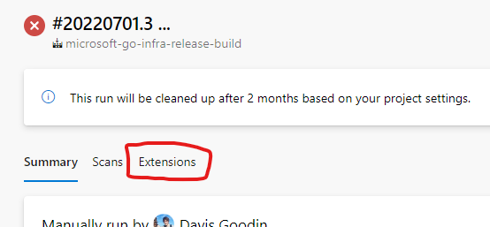

# How to use the release tooling

> Is this a brand new major version without a release branch set up in microsoft/go? For example, 1.19beta1, 1.19rc1, and 1.19 might be the first time releasing major version "19". If so, you need to create the release branch before continuing with this document. See [new-release-branch.md](new-release-branch.md). 

Open the [microsoft-go-infra-release-start](https://dev.azure.com/dnceng/internal/_build?definitionId=1153) pipeline definition. You will use it to kick off the release day.

Click "Run pipeline" and fill the fields:

First, determine the **list of versions to release**. Type them in as a YAML list (one version per line with a "`- `" prefix on each line):

* Upstream servicing event:
    * Always include the upstream version with a `-1` suffix. For example, for 1.18.5, include `1.18.5-1`.
    * If the version is <= 1.18, include a version with `-1-fips` suffix. For example, `1.18.5-1-fips`.
    * If the version is >= 1.19, no extra version is necessary.
* Microsoft Go servicing event:
    * Sometimes, we have to release when upstream hasn't made any changes. For example, to fix an issue with the FIPS implementation, or Go being built incorrectly by our infrastructure.
    * First, make sure the fixes have been cherry-picked to the applicable release branches--normally only the two most recent major versions.
    * Use the latest release's version number with the Microsoft revision number incremented by one. If `1.18.3-1` was the latest, use `1.18.3-2` as the new version.
        * Find the latest-released version at https://github.com/microsoft/go/releases that matches the major version of Go to find the latest release. Using the search feature may help filter the results to the relevant major.minor version.
        * Alternatively, look at the `VERSION` and `MICROSOFT_REVISION` files in the microsoft/go repo and Go submodule in the tip of the target release branch. The last-released Microsoft revision is `1` unless the `MICROSOFT_REVISION` file exists and says otherwise, and if `VERSION` is present in both the submodule and the microsoft/go repository, the microsoft/go copy wins.

Put your GitHub username in the **GitHub username to @mention** field. This will automatically subscribe you to any automatically detected action items that are posted as comments.

The **variable group** field should be filled in with `go-release-config` to let the build access the secrets necessary to perform a real release.

> Even though AzDO doesn't show the text selection cursor when you hover over the **variable group** description text, you can actually click and drag to select `go-release-config` and copy-paste it into the text box.
>
> It may seem strange that `go-release-config` isn't the default. But:
>
> * For testing, you can pass in a different variable group. Requiring this field to be filled in each time makes sure you intend to run a real release.
> * This makes infrastructure safer: if the build gets triggered and the set of parameters isn't passed correctly by tooling, the build fails safe by refusing to start.

For example, a security patch release for 1.18 and 1.19 may look like this:

> 

1. Now that the values are set, press Run.
    * It will take some time to reserve a build agent. Expect up to ten minutes.

1. Wait for notifications on the release tracking issue.
    * Continue once both of these builds complete successfully for every version in the release:
        * **microsoft-go-infra-release-build**
        * **microsoft-go-infra-release-innerloop**
    * If an error occurs, refer to the rest of this doc for diagnosis and retry guidance.

1. Click on the "microsoft-go-infra-release-go-images" build and approve it to let it continue.
    * Don't do this early. This pipeline updates active tags in MAR, so it's important to make sure the innerloop run is successful on the exact commit to be released.

1. Wait for a notification on the release tracking issue.
    * Continue if the images build is successful.

1. Send a message to the internal announcement distribution group about the new version!

1. Submit a PR to update Azure Linux 3.0 to use the new version of Go.
    * See [Azure Linux spec file update instructions](azurelinux-spec-update.md) for more details.

## Making the internal announcement

Check this internal OneNote page for more details: [Internal announcement email and DG](https://microsoft.sharepoint.com/teams/managedlanguages/_layouts/OneNote.aspx?id=%2Fteams%2Fmanagedlanguages%2Ffiles%2FTeam%20Notebook%2FGoLang%20Team&wd=target%28Main.one%7C62B655D4-14E7-41D6-A063-0869C28D63FC%2FInternal%20announcement%20email%20and%20DG%7C23BE5288-5430-4B45-A81B-9AE79776743C%2F%29).

## Diagnosing and fixing build errors

In general, the build uploads guidance to the "Extensions" tab when a failure occurs, such as a timeout:

> 

If this tab doesn't show up or doesn't contain relevant information, you may need to examine the build logs to determine the error.

> The "Rerun failed jobs" button at the top right *does not work* for release-build. This AzDO feature is not flexible enough to handle fixups. Don't worry: if you press it, the build will detect it and fail itself early.
