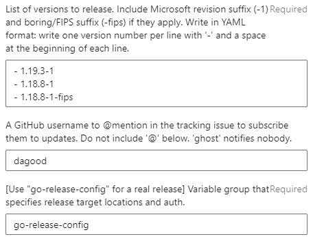

# How to use the release tooling

Open the [microsoft-go-infra-release-start](https://dev.azure.com/dnceng/internal/_build?definitionId=1153) pipeline definition. You will use it to kick off the release day.

Click "Run pipeline" and fill the fields:

First, determine the **list of versions to release**. Type them in as a YAML list (one version per line with a "`- `" prefix on each line):

* Upstream servicing event:
    * Always include the upstream version with a `-1` suffix. For example, for 1.18.5, include `1.18.5-1`.
    * If the version is <= 1.18, include a version with `-1-fips` suffix. For example, `1.18.5-1-fips`.
    * If the version is >= 1.19, no extra version is necessary.
* Microsoft Go servicing event:
    * Sometimes, we have to release when upstream hasn't made any changes. For example, to fix an issue with the FIPS implementation, or Go being built incorrectly by our infrastructure.
    * First, make sure the fixes have been cherry-picked to the applicable release branches--normally only the two most recent major versions.
    * Use the latest release's version number with the Microsoft revision number incremented by one. If `1.18.3-1` was the latest, use `1.18.3-2` as the new version.
        * Find the latest-released version at https://github.com/microsoft/go/releases that matches the major version of Go to find the latest release. Using the search feature may help filter the results to the relevant major.minor version.
        * Alternatively, look at the `VERSION` and `MICROSOFT_REVISION` files in the microsoft/go repo and Go submodule in the tip of the target release branch. The last-released Microsoft revision is `1` unless the `MICROSOFT_REVISION` file exists and says otherwise, and if `VERSION` is present in both the submodule and the microsoft/go repository, the microsoft/go copy wins.

The **variable group** field should be filled in with `go-release-config` to let the build access the secrets necessary to perform a real release.

> Even though AzDO doesn't show the text selection cursor when you hover over the **variable group** description text, you can actually click and drag to select `go-release-config` and copy-paste it into the text box.
>
> It may seem strange that `go-release-config` isn't the default. But:
>
> * For testing, you can pass in a different variable group. Requiring this field to be filled in each time makes sure you intend to run a real release.
> * This makes infrastructure safer: if the build gets triggered and the set of parameters isn't passed correctly by tooling, the build fails safe by refusing to start.

For example, a security patch release for 1.17 and 1.18 may look like this:

> 

1. Now that the values are set, press Run.
    * It will take some time to reserve a build agent. Expect up to ten minutes. Then, the job creates one issue to track the release day progress and one issue per version in the list.
    * You should make sure you're subscribed to each issue. The builds will post comments on these issues to alert you to successful jobs and failures. If you don't see the issues in the microsoft/go repository, look in the job logs. The "Create tracking issue" steps contain links.

1. Open the job logs, click on the "🚀 Start microsoft/go-images build" step, and click on the `Web build URL:` link.

1. Wait for notification about the "microsoft/go build prep steps" completing for each version.
    * If an error occurs, refer to the rest of this doc for diagnosis and retry guidance.

1. In the microsoft/go-images build, approve the build to let it continue.
    * It is ok to do this early. The approval gate only exists to prevent excessive polling.

1. Send a message to the internal announcement distribution group about the new version!
    * Check this internal page for more details: [Internal announcement email and DG](https://microsoft.sharepoint.com/teams/managedlanguages/_layouts/OneNote.aspx?id=%2Fteams%2Fmanagedlanguages%2Ffiles%2FTeam%20Notebook%2FGoLang%20Team&wd=target%28Main.one%7C62B655D4-14E7-41D6-A063-0869C28D63FC%2FInternal%20announcement%20email%20and%20DG%7C23BE5288-5430-4B45-A81B-9AE79776743C%2F%29)

## Diagnosing and fixing build errors

In general, the build uploads guidance to the "Extensions" tab when a failure occurs, such as a timeout:

> 

If this tab doesn't show up or doesn't contain relevant information, you may need to examine the build logs to determine the error.

> The "Rerun failed jobs" button at the top right *does not work* for release-build. This AzDO feature is not flexible enough to handle fixups. Don't worry: if you press it, the build will detect it and fail itself early.
