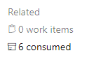

# Pipelines

This directory contains Azure DevOps (AzDO) YAML pipelines for CI and utilities.

Public pipeline definitions using these YAML files:

* [`pr-pipeline.yml`](pr-pipeline.yml) - PR validation
  * [`microsoft-go-infra`](https://dev.azure.com/dnceng/public/_build?definitionId=1051)

Internal pipeline definitions:

* [`update-images-pipeline.yml`](update-images-pipeline.yml) - Update dependencies in microsoft/go-images after a Go build.
  * [`microsoft-go-infra-update-images`](https://dev.azure.com/dnceng/internal/_build?definitionId=1040&_a=summary)
    * To manually queue an update to a specific build, use the "Resources" options in the "Run pipeline" dialog.
    * To see where an update came from, click the "X consumed" button:  
      > 
* [`upstream-sync-pipeline.yml`](upstream-sync-pipeline.yml) - Sync repositories with their upstreams.
  * [`microsoft-go-infra-upstream-sync`](https://dev.azure.com/dnceng/internal/_build?definitionId=1061)

Internal release pipelines (see [release process docs](/docs/release-process)):

* (1) [`release-go-start-pipeline.yml`](release-go-start-pipeline.yml)
  * [`microsoft-go-infra-release-start`](https://dev.azure.com/dnceng/internal/_build?definitionId=1153)
* (2) [`release-build-pipeline.yml`](release-build-pipeline.yml)
  * [`microsoft-go-infra-release-build`](https://dev.azure.com/dnceng/internal/_build?definitionId=1142)
* (3) [`release-go-images-pipeline.yml`](release-go-images-pipeline.yml)
  * [`microsoft-go-infra-release-go-images`](https://dev.azure.com/dnceng/internal/_build?definitionId=1151)